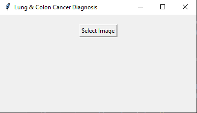
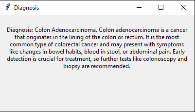

# Lung & Colon Cancer Detection

## Overview
This project is a **Lung & Colon Cancer Detection Tool** built using **Machine Learning**, **Deep Learning**, and **Computer Vision** techniques. It utilizes **Hugging Face**, **Transformers**, **TensorFlow**, **OpenCV**, **Tkinter**, **Pillow** and **Python** to create an intuitive, user-friendly interface for detecting lung and colon cancer from medical imaging data. The tool serves as a potential aid for healthcare professionals in early cancer detection, thus improving diagnostic accuracy.

## How It Works



1. **Upload an image** of a lung or colon scan (e.g., CT scan, biopsy image).
2. **The model classifies** the image into one of three categories:
   - **Lung Adenocarcinoma**: A type of lung cancer that starts in the glandular cells of the lung tissue.
   - **Colon Adenocarcinoma**: A cancer that originates in the lining of the colon or rectum.
   - **Normal Colon**: No signs of cancer detected in the colon.

The model then provides a detailed **diagnosis** with further recommendations for each classification.

## Skills
- **Machine Learning**
- **Deep Learning**
- **Python**
- **TensorFlow**
- **Hugging Face Transformers**
- **OpenCV**
- **Tkinter**
- **Computer Vision**
- **Artificial Intelligence**
- **Pillow**

## How to Use
1. **Clone the Repository**:
    ```bash
    git clone https://github.com/Kabir-Sidhu/Lung-and-Colon-Cancer-Detection
    ```

2. **Install Dependencies**:
    Install the required dependencies by running:
    ```bash
    pip install transformers tensorflow opencv-python matplotlib pillow torch
    ```

3. **Run the Application**:
    Run the application with the following command:
    ```bash
    python main.py
    ```

    This will open the GUI where you can upload medical images for classification.

## Contributing
Contributions are welcome! Please follow these steps to contribute:
1. Fork the repository.
2. Create a new branch for your feature or bug fix.
3. Submit a pull request with a clear explanation of your changes.

## License
This project is licensed under the GPL 2.0 License - see the [LICENSE](LICENSE) file for details.

---

### Example Classifications:
- **Lung Adenocarcinoma**: A type of lung cancer, commonly linked with smoking and exposure to carcinogens.
- **Colon Adenocarcinoma**: The most common form of colorectal cancer, often presenting with symptoms like blood in stool or abdominal pain.
- **Normal Colon**: No signs of cancer. Regular screening is advised, especially if there is a family history of colon cancer.
